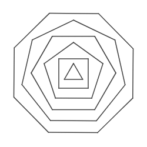

# Playing with Polygons

  

Welcome to Playing with Polygons! An idea that has its roots in 2014 with a bug in a university project.

Between University and now I have become a Web Developer. Then in 2020 - during the Covid-19 lockdown - I finally created a little app that takes that bug to its logical extreme.

If you want to lear about the sotry, check out my [blog post: Playing With Polygons - The Iceberg Story](https://dev.to/liammyles/my-covid-lockdown-project-the-iceberg-story-5bo2)

## About this Project

This project in essence terms is an app that lets you create polygon art. As well as allowing you to generate gif's once you make it.

Here are some examples of what I have made with it so far:

## How to Play with Polygons

The app is hosted on [this repos Git hub pages page](https://liammyles.github.io/playing-with-polygons/). just visit the link and away you go.

## Tech Used

So the core of the project is React written in typescript. With jest & react-testing-library being used for the testing.

Context and Reducers are used heavily to deal with the state of the app.

And p5 is the canvas library that is used to draw the polygons.

## Starting the Project for yourself

If you want to fork, or clone this project here is some basic things you need to do to get things up and running.

If you have ever used create react app, its just that.

### First time Setup

Once cloned, you can use `yarn` or `npm install` to install the packages.

### Development

The development environment has hot reloading. To start it use `yarn start` or `npm run start` which will start up the create react app development environment.

### Testing

To test the project use `yarn test` or `npm run test` which will start the jest test suite.

## Other Homes on the Web

Check out the [Playing with Polygons twitter](https://twitter.com/PlayingPolygons) to see and share polygon gifs!
